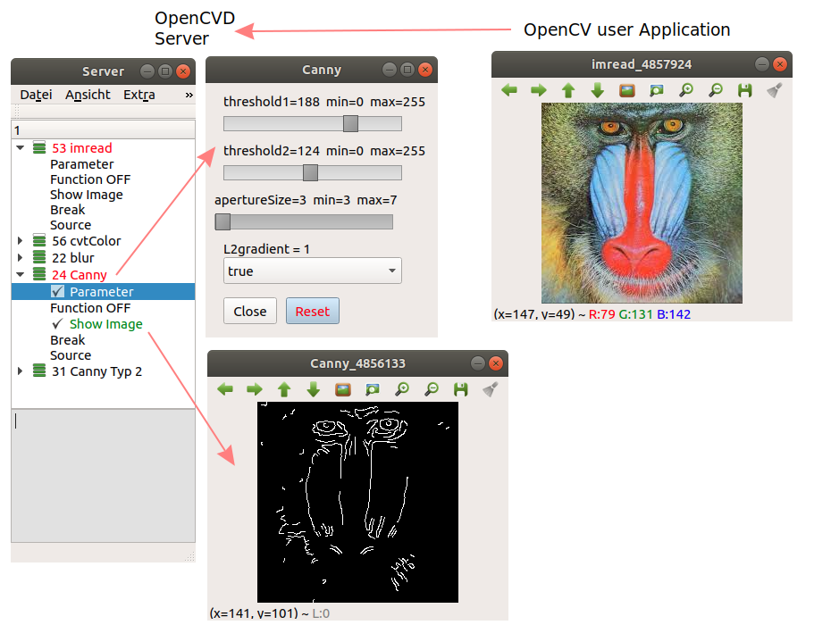

<strong>OpenCVD</strong>

OpenCVD ist eine interaktive Visualisierungssoftware.
Sie ermöglicht eine schnelle und effektive Unterstützung bei der Entwicklung von Bildverarbeitungs Applikationen.
Sie unterstützt eine Großzahl von OpenCV Funktionen. 
Darüber hinaus sind auch spezialisierte Bausteine verfügbar.

Die Arbeitsweise stellt sich wie folgt dar:

- In der Bildverarbeitungsapplikation wird anstelle von cv:: der namespace CVD:: verwendet.
- Die aufgerufenen CVD:: Funktionen leiten ihre Parameter zu einem lokalen Server.
- Dieser bietet nun die Möglichkeit, Funktionsparameter während der Laufzeit zu verändern.

Der Server bietet vollen Zugriff auf alle Funktionsparameter. Das einbinden von Eingabefeldern und Trackbars entfällt.

OpenCVD is an interactive visualization software.
It enables fast and effective support in the development of image processing applications. 
It supports a large number of OpenCV functions. 
In addition, specialized components are also available.

The working method is as follows:

- In the image processing application, the namespace CVD:: is used instead of cv::.
- The called CVD:: functions redirect their parameters to a local server.
- This server now offers the possibility to change function parameters during runtime.

The server offers full access to all function parameters. There is no need to integrate input fields and trackbars.

<strong>Example</strong>

see: samples/short_sample/short_sample.cpp

<strong>Entwicklungsumgebung / development-environment:</strong>

- Ubuntu 18.04.2 LTS
- OpenCV 3.3.0

<strong>Server:</strong>

- qtcreator
- Qt 5.9.5

<strong>Samples:</strong>

<strong>include:</strong>

- gcc version 7.3.0
- g++ --std=c++11
- OpenCV 3.3.0
- Makefile's use pkg-config --cflag --clib opencv.

<strong>aktuell folgende OpenCV Funktionen sind implementiert / currently the following OpenCV functions are implemented</strong>

- adaptiveThreshold
- blur
- Canny, cvtColor, calcHist, convertScaleAbs
- dilate
- erode
- findContours
- GaussianBlur, getStructuringElement
- HoughCircles, HoughLinesP, HoughLines
- imread
- Laplacian
- medianBlur, morphologyEx
- normalize
- resized
- Scharr, Sobel
- threshold
