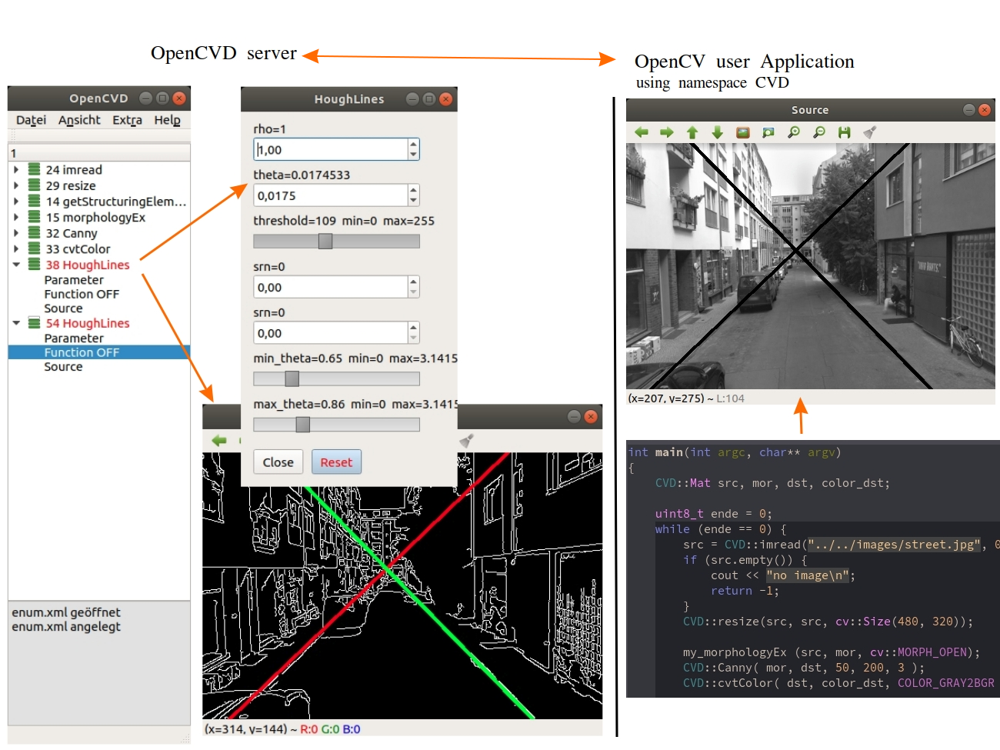

## OpenCVD

<p>OpenCVD ist eine interaktive Visualisierungssoftware.
Sie ermöglicht eine schnelle und effektive Unterstützung bei der Entwicklung von Bildverarbeitungs Applikationen.
Sie unterstützt eine Großzahl von OpenCV Funktionen. 
Darüber hinaus sind auch spezialisierte Bausteine verfügbar.</p>

Die Arbeitsweise stellt sich wie folgt dar:

- In der Bildverarbeitungsapplikation wird anstelle von cv:: der namespace CVD:: verwendet.
- Die aufgerufenen CVD:: Funktionen leiten ihre Parameter zu einem lokalen Server.
- Dieser bietet nun die Möglichkeit, Funktionsparameter während der Laufzeit zu verändern.

<p>Der Server bietet vollen Zugriff auf alle Funktionsparameter. Das einbinden von Eingabefeldern und Trackbars entfällt.</p>
<hr></hr>
<p>OpenCVD is an interactive visualization software.
It enables fast and effective support in the development of image processing applications. 
It supports a large number of OpenCV functions. 
In addition, specialized components are also available.</p>

The working method is as follows:

- In the image processing application, the namespace CVD:: is used instead of cv::.
- The called CVD:: functions redirect their parameters to a local server.
- This server now offers the possibility to change function parameters during runtime.

<p>The server offers full access to all function parameters. There is no need to integrate input fields and trackbars.</p>
<hr></hr>



<hr></hr>

### Example

see: samples/short_sample/short_sample.cpp

<hr></hr>

### Entwicklungsumgebung / development-environment

- Ubuntu 18.04.2 LTS
- OpenCV 3.3.0

### Server:

- qtcreator
- Qt 5.9.5

### Samples:

- gcc version 7.3.0
- g++ --std=c++11
- OpenCV 3.3.0
- Makefile's use pkg-config --cflag --clib opencv

<hr></hr>

### aktuell sind folgende OpenCV Funktionen implementiert / currently the following OpenCV functions are implemented

- adaptiveThreshold, approxPolyDP, addWeighted
- blur, buildPyramid, bilateralFilter, boxFilter
- Canny, cvtColor, calcHist, convertScaleAbs, cornerHarris, cornerMinEigenVal, cornerEigenValsAndVecs, createLineSegmentDetector, cornerSubPix, calcOpticalFlowFarneback, calcOpticalFlowPyrLK
- dilate, distanceTransform
- erode
- findContours, fitLine, filter2D
- GaussianBlur, getStructuringElement, grabCut, getGaussianKernel, getGaborKernel, getDerivKernels
- HoughCircles, HoughLinesP, HoughLines
- imread
- Laplacian
- medianBlur, morphologyEx, matchTemplate, matchShapes
- normalize
- pyrDown, pyrUp, pyrMeanShiftFiltering, putText, preCornerDetect
- resize, rectangle
- Scharr, Sobel, scaleAdd, sqrBoxFilter, sepFilter2D
- threshold

### cv::Mat Funktionen / cv::Mat functions

- Mat ( int rows, int cols, int type );
- Mat ( Size size, int type );
- Mat ( Size size, int type, const Scalar& s );
- Mat ( int rows, int cols, int type, const Scalar& s );
- Mat ( Mat &m, Rect &ROI );
- Mat.convertTo ( OutputArray m, int rtype, double alpha, double beta );
- Mat.assigTo ( Mat &m, int type );
- static MatExpr zeros(int rows, int cols, int type);
- static MatExpr zeros(Size size, int type);
- static MatExpr zeros(int ndims, const int* sz, int type);
- static MatExpr ones(int rows, int cols, int type);
- static MatExpr ones(Size size, int type);
- static MatExpr ones(int ndims, const int* sz, int type);
- static MatExpr eye(int rows, int cols, int type);
- static MatExpr eye(Size size, int type);

### cv::Scalar Funktionen / cv::Scalar functions

- Scalar ( v0, v1, v2, v4 );
- Scalar ( v0 );

### cv::Rect Funktionen / cv::Rect functions

- Rect (x, y, width, height);

### cv::Point Funktionen / cv::Point functions

- Point (x, y);

### cv::String Funktionen / cv::String functions

- String (const char* s);
- String (const String& str);
- String (const std::string& str);

### spezielle Funktionen / specific functions

- get_numval
- set_trackbar
- get_filename
- get_enumval
- set_cam_para

<hr></hr>

## OpenCV Installation

### 1. Update und Aktualisierungssoftware für Ubuntu / Update software for Ubuntu
```	
sudo su  
sudo apt-get -y update
sudo apt-get -y upgrade
sudo apt-get -y dist-upgrade
sudo apt-get -y autoremove
```	
### 2. Abhängigkeiten installieren / Install dependencies
```	
sudo apt-get install libopencv-dev
```
### 3. OpenCV Build-Tools installieren / Installing OpenCV Build Tools
```	
sudo apt-get install 
     build-essential \
     checkinstall \
     cmake \
     pkg-config
```
### 4. Zusatzbibliotheken für Bildverarbeitung / Additional libraries for image processing
```	
sudo apt-get install \
    libtiff5-dev \
    libjpeg-dev \
    zlib1g-dev \
    libopenexr-dev \
    libgdal-dev
```
### 5. Zusartbibliotheken für Vidioverarbeitung / Additional libraries for video processing
```	
sudo apt-get install \
    libavcodec-dev \
    libavformat-dev \
    libmp3lame-dev \
    libswscale-dev \
    libxine2-dev \
    libv4l-dev \
    v4l-utils \
    libfaac-dev \
    libopencore-amrnb-dev \
    libopencore-amrwb-dev \
    libtheora-dev libvorbis-dev \
    libxvidcore-dev \
    libx264-dev \
    x264 \
    yasm
```
### 6. weitere Bibliotheken / other libraries
```	  
sudo apt-get install \
    libtbb-dev \
    libeigen3-dev
```	
### 7. Bibliotheken für grafische Benutzeroberfläche / Libraries for graphical user interface
```	
sudo apt-get install \
    libqt4-dev \
    libgtk2.0-dev \
    qt5-default
```
### 8. OpenCV Quellcode / OpenCV source code 
```	
git clone https://github.com/opencv/opencv.git
git clone https://github.com/opencv/opencv_contrib.git

cd opencv
mkdir build
cd build

cmake -D CMAKE_BUILD_TYPE=RELEASE \
      -D OPENCV_GENERATE_PKGCONFIG=YES \
      -D CMAKE_INSTALL_PREFIX=/usr/local \
      -D INSTALL_C_EXAMPLES=ON \
      -D INSTALL_PYTHON_EXAMPLES=OFF \
      -D WITH_TBB=ON \
      -D WITH_V4L=ON \
      -D WITH_LIBV4L=ON \
      -D WITH_QT=ON \
      -D WITH_OPENGL=ON \
      -D WITH_EIGEN=ON \
      -D OPENCV_EXTRA_MODULES_PATH=../../opencv_contrib/modules \
      -D WITH_FFMPEG=ON \
      -D WITH_GTK=ON \
      -D WITH_CUBLAS=ON \
      -D WITH_CUDA=ON \
      -D CUDA_NVCC_FLAGS="-D_FORCE_INLINES" \
      -D FORCE_VKT=TRUE \
      -D WITH_VKT=ON \
      -D BUILD_DOC=ON \
      -D BUILD_EXAMPLES=ON ..  

make -j$(nproc)
sudo make install
sudo ldconfig
```	  
### 9. Installation prüfen / Check installation
```	  
pkg-config --modversion opencv
pkg-config --modversion opencv4
```
