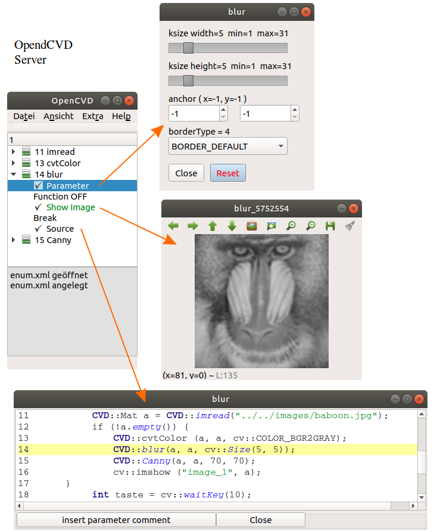

**OpenCVD Server**

Der OpenCVD Server bietet Änderungsmöglichkeiten für OpenCV Funktionen an. OpenCV Funktionsparameter lasse sich während der Laufzeit verändern. Hierfür werden entsprechende Eingabeelemente wie Slider, Editierfelder, usw. bereitgestellt. Erreicht wird der Server indem in der user Application der namespace CVD verwendet wird.

The OpenCVD Server offers modification options for OpenCV functions. OpenCV function parameters can be changed during runtime. For this purpose, corresponding input elements such as sliders, editing fields, etc. are provided. The server is reached by using the namespace CVD in the user application.

**Entwicklungsumgebung / development-environment**

- qtcreator
- Qt 5.9.5

